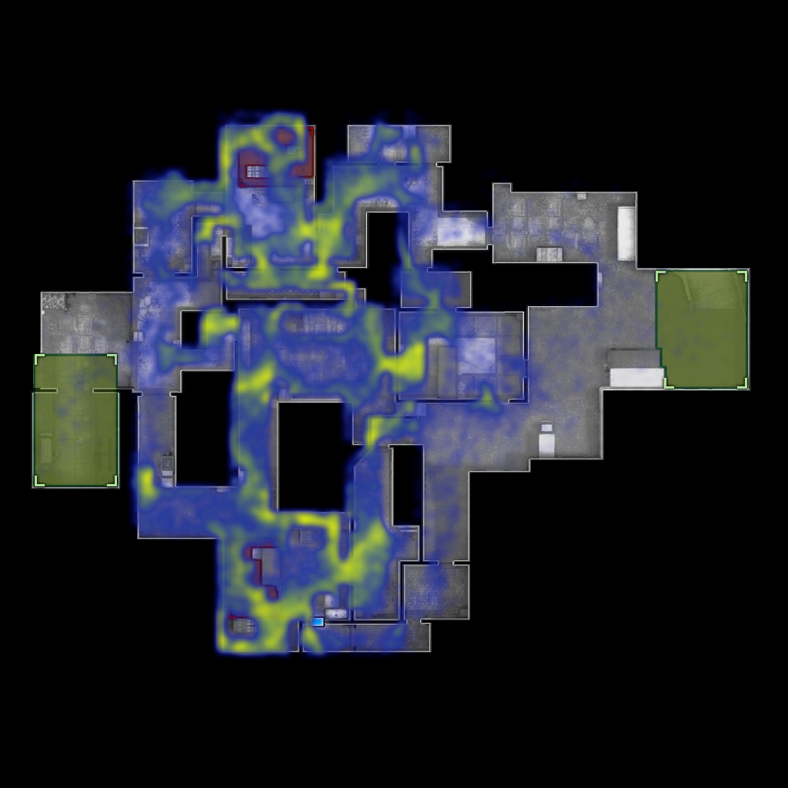
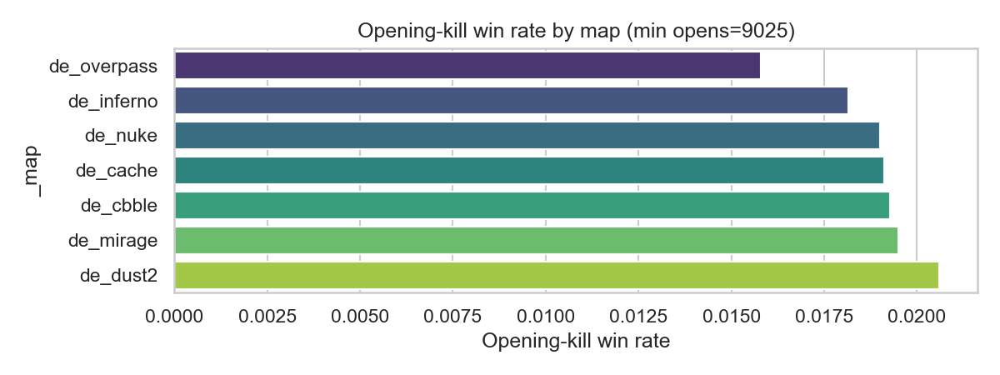
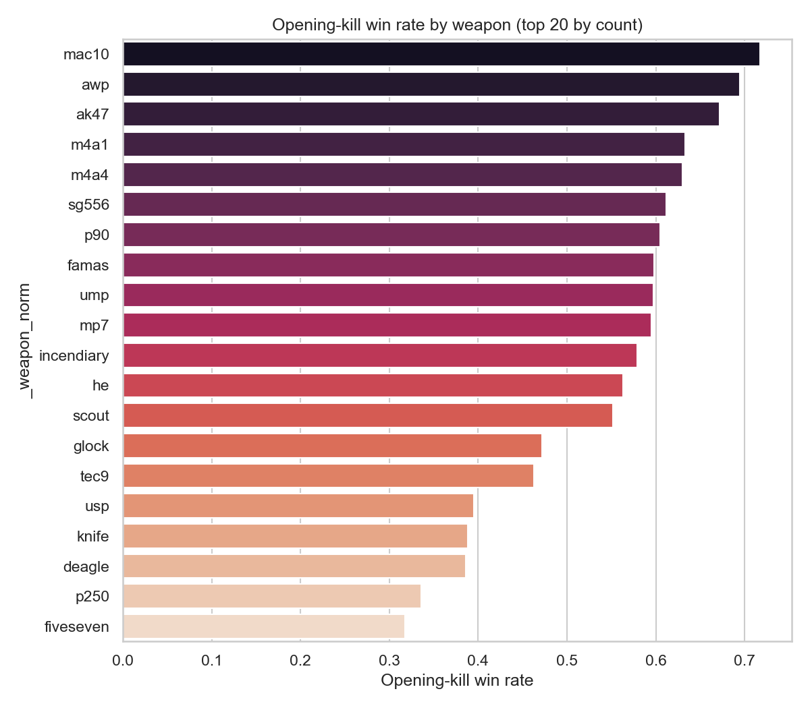

# BI exam project - Counter Strike Global Offensive Data analysis

Relevance and context:
    These datasets are about competitive and professional Coutner-strike: Global Offensive matches, which have many real world applications and 
demand for in depth data anylysis, both for professional esports matches, rookie teams, or just players who want to improve their understanding of the game in order to get on a higher level.

Two main approaches and be taken into consideration when trying to provide useful data for professional esports teams:

- Business side: esports organizations, betting platforms, training apps, player analytics tools, or streaming platforms.

- Social side: understanding teamwork dynamics, decision-making under pressure, game design improvements, or fair matchmaking.

How I have chosen to approach this:

- In competitive matches, a designated "entry fragger" is usually selected, or even signed onto a team. Their goal is to get the first elimination each round, which is vital for the attacking team to gain any footing. This is often a pivotal moment, and I want to explore how much of an impact the entry-frag (or the failure thereof) has on round outcome.

# Quick runbook: ETL → Train model → Generate visuals

Prerequirements 
- Python 3.10+
- Install project requirements:
    python -m venv .venv       # or use conda create -n bi venv python=3.13
    .venv\Scripts\activate     # Windows
    pip install -r requirements.txt

Run ETL (load & clean raw -> processed)
---------------------------------------
1. Clone this project

2. Download the two chosen datasets, 
    
    https://www.kaggle.com/datasets/skihikingkevin/csgo-matchmaking-damage/data
    
    https://www.kaggle.com/datasets/mateusdmachado/csgo-professional-matches
    
    and drag the contained .csv files into their respective folders inside data/raw.

3.  Open anaconda prompt

4.  Navigate to project root

5.  Windows:
      venv\Scripts\activate 
    mac/linux
      source venv/bin/activate

6.  python -m src.etl.etl_pipeline

This writes cleaned parquet files to `data/processed/` such as:
    data/processed/mm_master_clean.parquet
    data/processed/players_clean.parquet
    data/processed/economy_clean.parquet
    data/processed/merged_professional.parquet  (if present)

Generate heatmap overlays (optional)
-----------------------------------

Example script to generate overlays (existing):
    python scripts/generate_all_heatmaps.py

Train the ML model
------------------
Train the "first-kill wins" binary model and save artifact:
    python src/models/train.py

This writes artifact(s) to `models/mm_firstkill_binary.joblib` (and metrics JSON).

Predict
---------------------------------------------
The model can now be used to make predictions on winning team.

python src/models/predict.py

Visualize predictions / generate figures
----------------------------------------
Several scripts are provided for visuals. 

First elimination prediction vs. actual visualisation and winrate by weapon:
python sripts/viz/firstkill_predict_viz.py

Heatmaps of where damage is dealt from (attacker if available, then the receiver) 
python sripts/viz/firstkill_map_compare.py

Visualizers for interesting information gained from the cleaned datasets
python sripts/viz/raw_visualizer.py

Outputs (images and parquets) go to: data/processed/

## Sample visuals:

Cache Heatmap

Dust2 Heatmap

# run the app
streamlit run app/app.py

The app will let you choose a side and a weapon, and give you the predicted win rate! along with showing historical data for each weapon, and winrate for each side